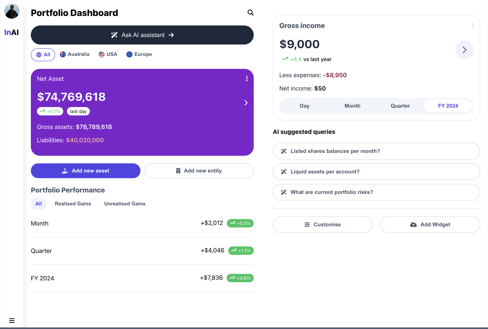

# Getting Started with The Project

This project was bootstrapped with [Create React App](https://github.com/facebook/create-react-app).

## Available Scripts

In the project directory, you can run:

### `npm start`

## Setup Process & Project Structure

1. The project was created using `npx create-react-app` with TypeScript
2. It is expected to have either `interface` or `type` for data type structure in the project.
3. In the `src` directory, folders were created according to its own functionality:
    - `components` directory contains the React Components.
    - `helper` directory contains any data formatter.
    - `pages` directory contains project pages to be rendered in the `page router`
    - `interface` directory contains data type from every component.
    - `styles` directory contains styling for general style and component style using `styled-components`.
4. Router was defined in `App.tsx`, and using `react-responsive` library for ease of responsive styling.
5. To run the project, please go to your local terminal and change your directory to the project, then type `npm install` to install project's dependencies.
6. Finally, run the `npm start` script.

## Assumptions

1. Unavailable data in assets balance list.

    
    It will render a message to inform the user that the assets is not available based on the group and country filter.

2. 0 money gains on unavailable date filter in Net asset

| Positive gain      | No gain      | Negative gain      |
| ------------- | ------------- | ------------- |
|  |  |  |

Assume that no data available by `Month` and `Day` filter, hence it will return 0 with black coloured text.

3. Scrollable asset list in Desktop

## Design consideration

Figma URL: https://www.figma.com/design/8hbd0bTl4e4FsnQhfI2rv3/InAI-Desktop?m=auto&t=3MdcjVAQa63eBrNv-1

### This only applies in desktop version

- ## Dashboard Page

I made the component styling fully the same as the desktop version, with only distinction on component width. To make all the components are filling the screen space,
2 Grid were implemented to split the selected components into 2 different grid.

- ## Asset Page

The same consideration applies in the Asset Page, the only distinction is that, the scrollable asset list on the right. Assume that there are huge amount of data, rather than make the viewport scroll to the bottom, I make the asset list component to have the maximum height, assume that the rendered height is overflowing the maximum height of the component, then it will be a scrollable component.